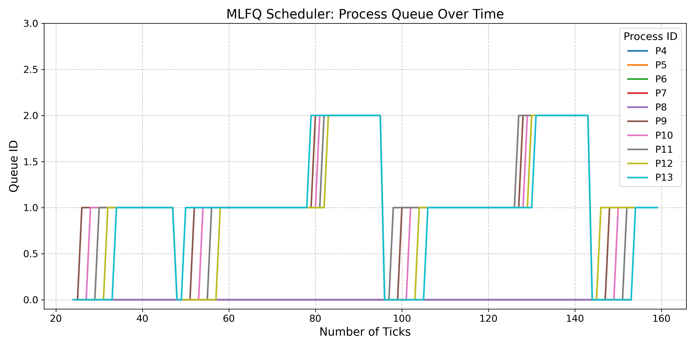
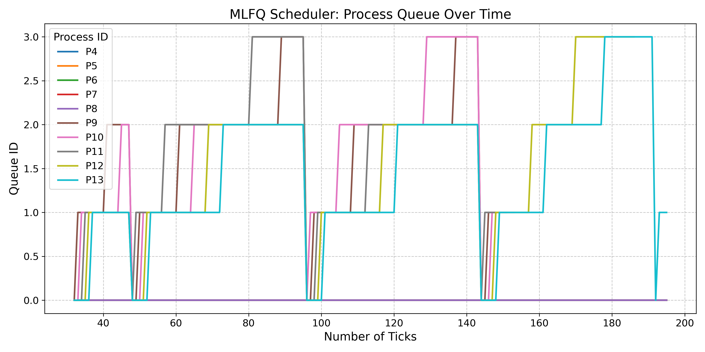

# XV6 Modifications Report

## 1. System Call Counting - `getSysCount` [7 points]

### Specification
I implemented the `getSysCount` system call and the corresponding user program `syscount`. The purpose of this system call is to count the number of times a specific system call was invoked by a process. The system call to be counted is selected using an integer mask passed through the command:
`syscount <mask> command [args]`


- The command runs until it exits, while the `syscount` program tracks the number of times the system call represented by the mask is called.
- The mask is represented by `1 << i`, where `i` corresponds to the syscall index in `syscall.h`.
- The output format after the command finishes execution is:
`PID <caller pid> called <syscall name> <n> times.`

- The total also includes the system calls made by the process's children until they are orphaned.

### Changes Made

#### proc.c
1. Added an array to store the syscall names:
```c
static char *syscallnames[] = {
  [SYS_fork]    "fork",
  [SYS_exit]    "exit",
  .....
  [SYS_getSysCount]   "getSysCount",
  [SYS_sigalarm]  "sigalarm",
  [SYS_sigreturn] "sigreturn",
  [SYS_settickets] "settickets",
};
```
2. In allocproc() function, initialized the syscall counts to zero:
```c
memset(p->syscall_counts, 0, sizeof(p->syscall_counts));  // Initialize counts to zero
```
3. In the fork() function, copied the parent's mask to the child process:
```c
np->mask = p->mask;  // Copying parent's mask
```
4. In the exit(int status) function, aggregated the syscall counts of the child process into the parent's counts:
```c
if (p->parent) {
    acquire(&p->parent->lock);
    for (int i = 0; i < 32; i++) {
        p->parent->syscall_counts[i] += p->syscall_counts[i];
    }
    release(&p->parent->lock);
}

for (int i = 1; i < 32; i++) {
    if ((p->mask >> i) & 1) {
        int total_count = p->syscall_counts[i];
        if (total_count > 0) {
            printf("PID %d called %s %d times.\n", p->pid, syscallnames[i], total_count);
        }
    }
}
```
#### proc.h
Added an array to store syscall counts and a mask to track which syscall to count:
```c
int syscall_counts[32];  // Array to store syscall counts
int mask;  // Mask to determine which syscall to track
```
#### syscall.c
1. Added the declaration of the sys_getSysCount function and mapped it to the syscall number:
```c
extern uint64 sys_getSysCount(void);
[SYS_getSysCount] sys_getSysCount,
```
2. Modified the syscall(void) function to increment the syscall count for the current process:
```c
// Increment syscall count for this process
p->syscall_counts[num]++;
```
#### syscall.h
Added the definition for the getSysCount syscall number:
```c
#define SYS_getSysCount  23
```

#### sysproc.c
Implemented the sys_getSysCount function to set the syscall mask for the process:
```c
uint64 sys_getSysCount(void) {
    int mask;
    struct proc *p = myproc();

    argint(0, &mask);  // Get the mask from the user
    p->mask = mask;    // Set the mask in the process structure

    return 0;
}
```
#### New `syscount.c` in the user folder
Created a user program to invoke getSysCount and execute the specified command:
```c
#include "kernel/types.h"
#include "kernel/stat.h"
#include "user/user.h"

int main(int argc, char *argv[]) {
    if (argc < 3) {
        fprintf(2, "Usage: syscount <mask> <command> [args]\n");
        exit(1);
    }

    int mask = atoi(argv[1]);

    if (getSysCount(mask) < 0) {
        fprintf(2, "syscount: getSysCount failed\n");
        exit(1);
    }

    // Prepare the arguments for the command to execute
    char *cmd_args[argc - 1];
    for (int i = 2; i < argc; i++) {
        cmd_args[i - 2] = argv[i];
    }
    cmd_args[argc - 2] = 0;

    // Execute the command
    exec(cmd_args[0], cmd_args);
    exit(0);
}
```
####  user.h
 Added the prototype for the getSysCount system call:
```c
int getSysCount(int);
```
#### ```usys.pl```
Added an entry for the new getSysCount system call:
```c
entry("getSysCount");
```

#### makefile
Updated the UPROGS section to include _syscount:
```make
UPROGS=\
  $U/_syscount
```
#### CONCLUSION
These changes successfully implemented the getSysCount system call in XV6, allowing the tracking of a specific syscall's invocation count for a process and its children, using a bitmask to specify the syscall.

## 2. Wake me up when my timer ends - `sigalarm` [13 points]

### Specification
In this feature, I implemented the `sigalarm(interval, handler)` system call, which periodically alerts a process as it uses CPU time. After every `n` ticks of CPU time, the kernel triggers the application’s function `fn`. When `fn` returns, the application resumes from where it left off. Additionally, I implemented the `sigreturn()` system call, which resets the process state to resume execution after the handler has completed.

### Changes made:

####  proc.c
Added the following system call names to the `syscallnames[]` array:
```c
[SYS_sigalarm]  "sigalarm",
[SYS_sigreturn] "sigreturn",
```
#### proc.h
Updated the struct proc to include fields related to the sigalarm mechanism:
```c
int interval;                // sigalarm ticks
uint64 handler;              // sigalarm handler function pointer
int currticks;               // ticks passed since the last call of handler
int staticinterval;          // save initial interval value
struct trapframe *initial_trapframe; // Trapframe to store details of the initial process state before the handler
```
#### syscall.c
Added the sigalarm and sigreturn system calls:
```c
extern uint64 sys_sigalarm(void);
extern uint64 sys_sigreturn(void);

[SYS_sigalarm]   sys_sigalarm,
[SYS_sigreturn]  sys_sigreturn,
```
### syscall.h
Defined the system calls:
```c
#define SYS_sigalarm  24
#define SYS_sigreturn 25
```

#### sysproc.c
Implemented the sys_sigalarm and sys_sigreturn functions:
```c
uint64
sys_sigalarm(void)
{
  int interval;
  uint64 handler;
  argint(0, &interval);
  argaddr(1, &handler);
  if (interval < 0)
    return -1;
  struct proc *p = myproc();
  p->interval = interval;
  p->staticinterval = interval;
  p->handler = handler;
  return 0;
}

uint64
sys_sigreturn(void)
{
  struct proc *p = myproc();
  memmove(p->trapframe, p->initial_trapframe, sizeof(struct trapframe));
  p->interval = p->staticinterval;
  p->currticks = 0;
  return p->trapframe->a0;
}
```
#### trap.c
Updated the usertrap() function to handle the sigalarm logic:
```c
if(which_dev == 2) {
    if(p->interval > 0) {
      if (p->currticks >= p->interval) {
        p->interval = 0;
        p->initial_trapframe = (struct trapframe *)kalloc();
        if (p->initial_trapframe == 0) {
          panic("sigalarm: kalloc failed");
        }
        memmove(p->initial_trapframe, p->trapframe, sizeof(struct trapframe));
        p->trapframe->epc = p->handler;
      } else {
        p->currticks++;
      }
    }
    yield();
}
```
#### user.h
Declared the user-space functions for the new system calls:
```c
int sigalarm(int ticks, void (*handler)());
int sigreturn(void);
```
#### ```usys.pl```
Added entries for the sigalarm and sigreturn system calls:
entry("sigalarm");
entry("sigreturn");

### CONCLUSION
The sigalarm and sigreturn system calls introduce periodic user-level interrupts in xv6, allowing processes to handle CPU time more effectively. These features enable a process to execute a custom handler function at regular intervals and then resume normal operation, providing a simple yet powerful way to manage CPU-intensive tasks or perform periodic actions.

## Lottery-Based Scheduling - `settickets` [15 points]

### Specification
I implemented a preemptive **Lottery-Based Scheduling** (LBS) policy in xv6, which assigns a time slice to processes based on the number of tickets they own. The probability that a process runs during a given time slice is proportional to its ticket count. This implementation includes a system call, `settickets`, which allows processes to modify their number of tickets.

- By default, each process starts with one ticket.
- Calling `settickets(int number)` enables a process to increase its ticket count, thus enhancing its chances of being scheduled.
- If multiple processes have the same number of tickets, the process that arrived first is favored.
- Only processes in the RUNNABLE state can participate in the lottery.

### Changes Made

#### proc.c
1. **Random Number Generator**:
   Implemented a Linear Congruential Generator (LCG) to provide randomness:
   ```c
   unsigned int seed = 42949672;
   int rand() {
       seed = (1664525 * seed + 1013904223);  // Standard LCG formula
       return seed;  // Returns a pseudo-random number
   }
   ```
   #### NOTE->
    this is not a random number generator in the true sense that it doesnt use any random value to make it random use ticks(XV6 time)
    ```c
    unsigned int seed = 0;
    int rand() {
        seed = ((1664525 * ticks)%1000000007 + 1013904223)%1000000007;  // Standard LCG formula with constants
        // printf("%d\n",seed);
        return seed;  // Return a number in the range [0, ticket-1]
    }
    ```

2. Add to syscallnames Array: Registered the settickets system call:
```c
[SYS_settickets] "settickets",
```
3. Set Default Tickets in allocproc(): Each new process starts with one ticket:
```c
p->tickets = 1;
```
4. Set Tickets in fork(): Child processes inherit their parent's ticket count:
```c
np->tickets = p->tickets;
```
5. Modify Scheduler in scheduler(): Implemented the lottery-based scheduling algorithm:
```c
void scheduler(void) {
    for(;;) {
        // Existing code...
        #ifdef LBS
            struct proc *p;
            struct proc *runnow=0;
            int totalticket=0;
            for(p=proc;p<&proc[NPROC];p++){
            acquire(&p->lock);
            if(p->state==RUNNABLE){
                totalticket=totalticket+p->tickets;
            }
            release(&p->lock);
            }
            if(totalticket==0){
            continue;
            }
            int winner=rand()%totalticket;
            int count=0;
            for(p=proc;p<&proc[NPROC];p++){
            acquire(&p->lock);
            if(p->state==RUNNABLE){
                count=count+p->tickets;        
            }
            if(p->state==RUNNABLE&&count>winner&&runnow==0){
                runnow=p;
            }
            release(&p->lock);
            }
            if (runnow!=0){
            for (p=proc; p<&proc[NPROC]; p++){
                acquire(&p->lock);
                if (p->state==RUNNABLE && p->tickets==runnow->tickets){
                if (p->ctime<runnow->ctime){
                    runnow= p;
                }
                }
                release(&p->lock);
            }
            }
            if(runnow!=0){
            acquire(&runnow->lock);
            if(runnow->state==RUNNABLE){
                runnow->state=RUNNING;
                c->proc=runnow;
                swtch(&c->context,&runnow->context);
                c->proc=0;
            }
            release(&runnow->lock);
            }
        #endif
    }
}
```
#### NOTE->
if you think the random process allotment and choosing process is wrong you can make modifications and use this code instead 
```c
void scheduler(void) {
    for(;;) {
        // Existing code...
        #ifdef LBS
            struct proc *p;
            struct proc *runnow = 0;
            int totalticket = 0;

            // Calculate total tickets from RUNNABLE processes
            for(p = proc; p < &proc[NPROC]; p++) {
                acquire(&p->lock);
                if(p->state == RUNNABLE) {
                    totalticket += p->tickets;
                }
                release(&p->lock);
            }

            if(totalticket == 0) {
                continue;  // No runnable processes
            }

            int winner = rand() % totalticket;
            int count = 0;

            // Select the winning process
            for(p = proc; p < &proc[NPROC]; p++) {
                acquire(&p->lock);
                if(p->state == RUNNABLE) {
                    count += p->tickets;        
                    if(count > winner) {
                        if(runnow == 0 || (runnow->tickets == p->tickets && runnow->ctime > p->ctime)) {
                            runnow = p;
                        }     
                    }
                }
                release(&p->lock);
            }

            // Run the selected process
            if(runnow != 0) {
                acquire(&runnow->lock);
                if(runnow->state == RUNNABLE) {
                    runnow->state = RUNNING;
                    c->proc = runnow;
                    swtch(&c->context, &runnow->context);
                    c->proc = 0;
                }
                release(&runnow->lock);
            }
        #endif
    }
}
```

#### proc.h
Struct Modification: Updated the process structure to include a tickets field:
```c
int tickets;  // Number of tickets for lottery-based scheduling
```

#### syscall.c
Declare the System Call: Added the system call for settickets:
```c
extern uint64 sys_settickets(void);
[SYS_settickets] sys_settickets,
```

#### syscall.h
Define the System Call Number: Added a definition for the settickets syscall:
```c
#define SYS_settickets  26
```

#### sysproc.c
Implement the sys_settickets Function: This function allows the current process to set its ticket count:
```c
int sys_settickets(void) {
    int number;
    argint(0, &number);
    if(number <= 0) {
        return -1;  // Invalid ticket number
    }
    struct proc *p = myproc();
    p->tickets = number;
    return 0;  // Success
}
```

#### user.h
User-Level Function Declaration: Declared the settickets function:
```c
int settickets(int);
```

#### ```usys.pl```
User-Level Function Entry: Registered the settickets system call:
entry("settickets");

#### makefile
1. Modify Compilation Flags: Added the SCHEDULER macro to allow compilation with different scheduling policies:
```makefile
CFLAGS += "-D$(SCHEDULER)"
```
2. Set default scheduler to RR at the top of the makefile
```c
SCHEDULER=RR
```
#### Compilation Instructions
To compile xv6 with the Lottery-Based Scheduling policy, use the following command:
```bash
make clean; make qemu SCHEDULER=LBS
```

#### CONCULSION
This implementation provides a flexible scheduling system in xv6 where processes can influence their scheduling by managing the number of tickets they hold. This aligns with the principles of fairness and responsiveness in multitasking environments.

## 2. MLF Who? MLFQ! [25 points]

### NOTE- i have implemented this using two methods first without using queue structure and second with using it my final code is with the queue structure and should be considered the first one in my opinion does not implement round robin correctly so done the second one also i have attached the graphs and data sets for both implementations in my submission 

### Specification
In this feature, I implemented a preemptive Multi-Level Feedback Queue (MLFQ) scheduler. The scheduler utilizes four priority queues to manage process execution based on their CPU usage and behavior. 

**Details:**
- **Queue 0:** Highest priority (1 timer tick time slice)
- **Queue 1:** Medium priority (4 timer ticks time slice)
- **Queue 2:** Lower medium priority (8 timer ticks time slice)
- **Queue 3:** Lowest priority (16 timer ticks time slice)

Processes start in Queue 0 and move down the queues based on their behavior. If a process uses its entire time slice, it is demoted to the next lower queue. If a process voluntarily relinquishes the CPU, it remains in the same queue. To prevent starvation, processes are moved back to Queue 0 after 48 ticks.

### Changes made:
### NOTE - for first implementation (without using queues explicitly)
#### proc.h
Updated the `struct proc` to include fields for managing MLFQ scheduling:
```c
int queuepriority;           // Current priority queue of the process
int currentticks;           // Number of ticks used in the current queue
int timespentincurrqueue;   // Total time spent in the current queue
```

#### proc.c
1. In allocproc(void), initialize process fields:
```c
p->queuepriority = 0;  // Start in highest priority queue
p->currentticks = 0;   // Initialize current ticks
p->timespentincurrqueue = 0;  // Initialize time in current queue
```
2. In userinit(void), ensure new processes start with MLFQ settings:
```c
p->queuepriority = 0;  // Highest priority queue
p->currentticks = 0;   // Initialize current ticks
```
3. In scheduler(void), implement MLFQ logic:
```c
#ifdef MLFQ
struct proc* p;
struct proc* runnow = 0;

for (p = proc; p < &proc[NPROC]; p++) {
    if (p->state == RUNNABLE) {
        int timeslice = -1;
        switch (p->queuepriority) {
            case 0: timeslice = 1; break;
            case 1: timeslice = 4; break;
            case 2: timeslice = 8; break;
            case 3: timeslice = 16; break;
            default: timeslice = -1; break;
        }
        if (p->currentticks > timeslice) {
            if (p->queuepriority != 3) {
                p->queuepriority++;
                p->currentticks = 0;
                p->timespentincurrqueue = 0;
            }
            else{
                p->currentticks=0;
                p->timespentincurrqueue=0;
            }
        }
    }
}

int maxwaittime = -1;
for (p = proc; p < &proc[NPROC]; p++) {
    acquire(&p->lock);
    if (p->state == RUNNABLE && p != 0) {
        if (maxwaittime == -1) {
            runnow = p; 
            maxwaittime = runnow->timespentincurrqueue;
        } else {
            if (p->queuepriority <= runnow->queuepriority) {
                if (p->queuepriority < runnow->queuepriority) {
                    runnow = p;
                } else if (p->timespentincurrqueue > runnow->timespentincurrqueue) {
                    runnow = p;
                }
            }
        }
    }
}

for (p = proc; p < &proc[NPROC]; p++) {
    if (p != runnow) {
        release(&p->lock);
    }
}

if (runnow && runnow->state == RUNNABLE) {
    runnow->timespentincurrqueue = 0;
    runnow->state = RUNNING;
    c->proc = runnow;
    swtch(&c->context, &runnow->context);
    c->proc = 0;
    release(&runnow->lock);
}
#endif
```
4. update_time
In the update_time function, update the times spent in the current queue:
```c
for (p = proc; p < &proc[NPROC]; p++) {
    if (p->state == RUNNABLE) {
        p->timespentincurrqueue++;
    }
}
```
#### trap.c
1. In usertrap(void) and kerneltrap(), implement the MLFQ yielding logic:
```c
if (which_dev == 2) {
#ifndef MLFQ
    yield();
#elif defined MLFQ
    int timeslice = -1;
    switch (p->queuepriority) {
        case 0: timeslice = 1; break;
        case 1: timeslice = 4; break;
        case 2: timeslice = 8; break;
        case 3: timeslice = 16; break;
        default: timeslice = -1; break;
    }
    p->currentticks++;
    if (p->currentticks > timeslice) {
        yield();
    }
    int changed=0;
    struct proc* check;
    for(check=proc;check<&proc[NPROC];check++){
    if(check->state==RUNNABLE && check!=0){
    if(check->queuepriority<p->queuepriority){
    changed=1;}}}
    if(changed){
      yield();}
#endif
}
```
2. In clockintr():
The clock ticks are incremented here after every timer interrupt, so implementing priority boosting here after every 48 ticks
```c
#ifdef MLFQ
struct proc* p;
if (ticks % 48 == 0) {
    for (p = proc; p < &proc[NPROC]; p++) {
        if (p->state == RUNNABLE || p->state == RUNNING) {
            p->queuepriority = 0;  // Reset to highest priority queue
            p->currentticks = 0;
            p->timespentincurrqueue = 0;
        }
    }
}
#endif
```

### NOTE- for second implementation(using queues explicitly)

#### proc.h
1. Updated the struct proc to include fields for managing MLFQ scheduling:
```c
int queuepriority2;        // Current priority queue of the process
int currentticks2;         // Number of ticks used in the current queue
```
2. Added function declarations for enqueue and dequeue:
```c
void dequeue(struct proc *p);
void enqueue(struct proc *p, int level);
extern struct proc *mlfqueue[4][NPROC];
extern int queuesize[4];
```

#### proc.c
1. Global Arrays for MLFQ:
```c
int queuesize[4] = {0};
struct proc *mlfqueue[4][NPROC];
```

2. allocproc(void) Function: Initialize MLFQ-specific fields for a new process:
```c
p->currentticks2 = 0;    // Initialize current ticks for the queue
p->queuepriority2 = 0;   // Start at the highest priority queue
```

3. userinit(void) Function: Ensure that the first process starts with the MLFQ settings:
```c
#ifdef MLFQ
enqueue(p, 0);  // Add process to the highest priority queue
#endif
```

4. fork(void) Function: Set the child process's MLFQ settings:
```c
#ifdef MLFQ
np->queuepriority2 = 0;
np->currentticks2 = 0;
enqueue(np, 0);  // Enqueue new process in the highest priority queue
#endif
```

5. MLFQ enqueue and dequeue Functions:
enqueue(struct proc *p, int level): Adds a process to the specified priority level.
dequeue(struct proc *p): Removes the process from its current queue.
```c
void enqueue(struct proc *p, int level)
{
    for(int i = 0; i < queuesize[level]; i++) {
        if(mlfqueue[level][i]->pid == p->pid) return;
    }
    if(p->state != RUNNABLE) return;
    p->queuepriority2 = level;
    mlfqueue[level][queuesize[level]++] = p;
}

void dequeue(struct proc *p)
{
    int level = p->queuepriority2;
    if(queuesize[level] == 0) return;
    for(int i = 0; i < queuesize[level]; i++) {
        if(mlfqueue[level][i]->pid == p->pid) {
            mlfqueue[level][i] = 0;
            for(int j = i; j < queuesize[level] - 1; j++) {
                mlfqueue[level][j] = mlfqueue[level][j + 1];
            }
            queuesize[level] -= 1;
            return;
        }
    }
}
```

6. scheduler(void) Function: Implement MLFQ scheduling logic:
```c
#ifdef MLFQ
// Send all runnable processes to the queue
for(struct proc *p = proc; p < &proc[NPROC]; p++) {
    if(p->state == RUNNABLE) enqueue(p, p->queuepriority2);
}

// Choose a process to run from the highest available priority
struct proc* runnow = 0;
for(int level = 0; level < 4; level++) {
    if(queuesize[level] != 0) {
        runnow = mlfqueue[level][0];
        dequeue(runnow);
        break;
    }
}

// Run the selected process
if(runnow != 0) {
    acquire(&runnow->lock);
    if(runnow->state == RUNNABLE) {
        runnow->state = RUNNING;
        c->proc = runnow;
        swtch(&c->context, &runnow->context);
        c->proc = 0;
    }
    release(&runnow->lock);
}
#endif
```

7. sleep() Function: Remove the process from its current queue when it goes to sleep:
```c
#ifdef MLFQ
dequeue(p);
#endif
```

8. kill(int pid) Function: Ensure the process is removed from the queue when it is killed:
```c
#ifdef MLFQ
dequeue(p);
#endif
```

#### trap.c 
1. usertrap(void) Function: Check if a process has exceeded its time slice and yield if necessary:
```c
#ifndef MLFQ
yield();
#elif defined MLFQ
p->currentticks2++;
int val = 0;
switch(p->queuepriority2) {
    case 0:
        if(p->currentticks2 >= 1) { val = 1; break; }
    case 1:
        if(p->currentticks2 >= 4) { val = 1; break; }
    case 2:
        if(p->currentticks2 >= 8) { val = 1; break; }
    case 3:
        if(p->currentticks2 >= 16) { val = 1; break; }
    default:
        val = 0;
}

if(val) {
    if(p->queuepriority2 != 3) p->queuepriority2 += 1;
    p->currentticks2 = 0;
    yield();
} else {
    int val2 = 0;
    for(int level = 0; level < p->queuepriority2; level++) {
        for(int i = 0; i < queuesize[level]; i++) {
            if(mlfqueue[level][i]->state == RUNNABLE) val2 = 1;
        }
    }
    if(val2) yield();
}
#endif
```

2. trap.c - kerneltrap() Function:
Similarly, check for time slice violations and yield:
```c
if(which_dev == 2 && myproc() != 0 && myproc()->state == RUNNING) {
    #ifndef MLFQ
    yield();
    #elif defined MLFQ
    struct proc *p = myproc();
    p->currentticks2++;
    int val = 0;
    switch(p->queuepriority2) {
        case 0:
            if(p->currentticks2 >= 1) { val = 1; break; }
        case 1:
            if(p->currentticks2 >= 4) { val = 1; break; }
        case 2:
            if(p->currentticks2 >= 8) { val = 1; break; }
        case 3:
            if(p->currentticks2 >= 16) { val = 1; break; }
        default:
            val = 0;
    }

    if(val) {
        if(p->queuepriority2 != 3) p->queuepriority2 += 1;
        p->currentticks2 = 0;
        yield();
    } else {
        int val2 = 0;
        for(int level = 0; level < p->queuepriority2; level++) {
            for(int i = 0; i < queuesize[level]; i++) {
                if(mlfqueue[level][i]->state == RUNNABLE) val2 = 1;
            }
        }
        if(val2) yield();
    }
    #endif
}
```

3. clockintr(void) Function:
Perform priority boosting every 48 ticks:
```c
ticks++;
#ifdef MLFQ
struct proc *check;
if(ticks % 48 == 0) {
    for(check = proc; check < &proc[NPROC]; check++) {
        acquire(&check->lock);
        if(check->state != UNUSED) {
            dequeue(check);
            check->queuepriority2 = 0;
            check->currentticks2 = 0;
            enqueue(check, 0);
        }
        release(&check->lock);
    }
}
struct proc *p = myproc();
if(ticks % 48 == 0) {
    if(p && p->state == RUNNING) {
        acquire(&p->lock);
        p->state = RUNNABLE;
        release(&p->lock);
    }
}
#endif
update_time();
```

#### Compilation Instructions
To compile the modified XV6 with the new MLFQ scheduler, use the following command:
```makefile
make clean; make qemu SCHEDULER=MLFQ CPUS=1
```

#### CONCLUSION
The MLFQ scheduler efficiently allocates CPU time across multiple priority queues, adapting to process behavior and preventing starvation through periodic priority boosting. This enhances responsiveness and overall performance in the XV6 operating system.

# Performance Comparison

The following table summarizes the average running and waiting times for processes under the default Round Robin (RR) scheduling policy, as well as the two implemented scheduling policies: Lottery-Based Scheduling (LBS) and Multi-Level Feedback Queue (MLFQ).

| Scheduling Policy | Average Running Time (rtime) | Average Waiting Time (wtime) |
|--------------------|------------------------------|-------------------------------|
| Default (RR)       | 13                           | 152                           |
| Lottery-Based      | 13                           | 148                           |
| Multi-Level Feedback Queue (MLFQ) | 13               | 152(both implementations)                          |

This comparison highlights the improvements in waiting time achieved with the LBS and MLFQ policies while maintaining the same average running time for all scheduling methods.

### Question
Answer the following in 3-4 lines, and optionally provide an example: What is the implication of adding the arrival time in the lottery-based scheduling policy? Are there any pitfalls to watch out for? What happens if all processes have the same number of tickets?

### Answer
Incorporating arrival time into a lottery-based scheduling policy allows processes that arrive earlier to be prioritized, enhancing fairness and reducing waiting times for newly initiated processes. However, this change introduces complexities in managing tickets and may lead to significant pitfalls, such as starvation, where lower-priority processes may rarely be selected for execution if higher-priority processes continuously enter the queue. The lottery scheduling algorithm also requires additional overhead to generate lottery tickets and randomly select winners, which can be considerable in systems with many processes. If all processes have the same number of tickets, the scheduler treats them equally, resulting in behavior similar to first-come, first-served scheduling, undermining the randomness intended by the lottery mechanism. For example, if two processes arrive simultaneously and both have the same number of tickets, they would have equal chances of being scheduled, making the system behave more like a basic round-robin approach.


# MLFQ Analysis

## Generating the Data

To analyze the behavior of processes in the Multi-Level Feedback Queue (MLFQ) scheduling algorithm, we need to collect data on which queue each process is in over time. To do this, we have made a modification in the `update_time` function, which is called each time the tick (used to monitor time in XV6) is incremented. We added the following code snippet at the end of the `update_time` function:

```c
#ifdef MLFQ
for (p = proc; p < &proc[NPROC]; p++)
{
    if (p->state == RUNNABLE || p->state == RUNNING)
        printf("%d %d %d\n", p->pid, ticks, p->queuepriority);
}
#endif
```
This code generates data in the format:
```css
p->pid, ticks, p->queuepriority

## Running the Command

```
To generate the data, run the following command in the terminal:
```bash
make qemu SCHEDULER=MLFQ CPUS=1 | tee data.txt
```
This command will run the XV6 simulator with the MLFQ scheduler and save the output, including the process ID, ticks, and queue priority, to a file named data.txt.

## Generating the Timeline Graph

Once the data is generated, you can visualize it using the following Python script. Make sure you have pandas and matplotlib installed in your Python environment.
```python
import pandas as pd
import matplotlib.pyplot as plt
import numpy as np

# Read the data from the file
data = pd.read_csv('data.txt', delim_whitespace=True, header=None, names=['pid', 'ticks', 'queuepriority'])

# Ensure the data is sorted by ticks
data.sort_values(by='ticks', inplace=True)

# Create a line plot for the timeline graph
plt.figure(figsize=(12, 6))

# Plot each process with a different color and connect the points with lines
for pid in sorted(data['pid'].unique()):  # Sort process IDs
    process_data = data[data['pid'] == pid]
    # Plot line connecting all points of the same process, without markers
    plt.plot(process_data['ticks'], process_data['queuepriority'], label=f'P{pid}', linewidth=2)  # Increased line width for better visibility

# Set the labels and title
plt.title('MLFQ Scheduler: Process Queue Over Time', fontsize=16)
plt.xlabel('Number of Ticks', fontsize=14)
plt.ylabel('Queue ID', fontsize=14)

# Set the y-axis ticks to have increments of 0.5 from 0 to 3 (or more if necessary)
plt.yticks(np.arange(0, 3.5, 0.5))

# Beautify the graph
plt.xticks(fontsize=12)
plt.yticks(fontsize=12)
plt.grid(True, linestyle='--', alpha=0.7)
plt.legend(title='Process ID', fontsize=12, title_fontsize='13', loc='best')

# Adjust layout and save the plot
plt.tight_layout()
plt.savefig('mlfq_timeline_graph_connected_custom_yticks.png', dpi=300)
plt.show()
```

## Graph Output

The graph will be saved in the same directory as the script with the name ```mlfq_timeline_graph_connected_custom_yticks.png```
### 1st graph(without using queues explicitly)



### 2nd graph(using queues explicitly)

